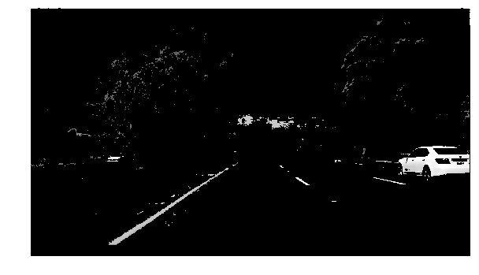

# **Finding Lane Lines on the Road** 

## Pipeline

The pipeline is based on the Canny edge detection and the Hough transform. However, the Hough tranform only identifies the line segments for the lanes, which varies a lot for dotted lanes. To extract the underlying line representing the lane, We make the assumption that the car is driving in the middle of two lanes. Thus, for the left lane, we only look at the line segments on he left half of the image and fit a line to them to represent the lane. The right lane can be detected similarly. 

### 1. Preprocess the image for lane detection

We first convert the image to gray scale.

For edge detection, we add mask for yellow and white pixels with the assumption that lanes are either yellow or white. This mask helps as the yellow lane might not have enough contrast when the road is bright. To segment the yellow pixels, we look at the image in the HSV space and create a mask in the range $()$ and $()$.

Unfortunately, the white pixels are not easy to identify in the HSV space . To segment the white pixels, we look at the image in the HSL space (HLS in cv2) and create a mask in the range $()$ and $()$.

Together we get masked gray scale image as follows.

### 2. Detecting the right lane

We detect the left and the right lanes separately. For the right lane, we use the following mask on the image.

After the Canny edge detection and the mask, we get the following remaining edges.

Then after the Hough transform, we find line segments as follows. These line segements could be noisy. For dotted lines the line segments would be changing frame by frame. In addition, as the lane mark has non-zero width, we expect to get two line segments on each side of a lane mark.

The next step is to extrapolate a single line representing the lane these line segments represent. Here we simply fit a linear function $x = a * y + b$ to get the line. Note that we choose to view $x$ as a function of $y$ as it is easier to set the $y$ boundary of the line. The image below shows the fitted line with the mask applied.

### 3. Detecting the left lane

The left lane can be approximated similarly.

### 4. Overlay the lanes with the original image

Finally we overlay the left and right lanes with the original image and get the result.

## Shortcomings and possible improvements

### 1. It is expensive to use both HSV and HSL.

It is easier to segment yellow pixels with HSV and easier to segment white pixels with HSL. It seems possible to use HSL or some other transform to segment both yellow and white pixels to save half of the computation cost. 

### 2. The assumption that the car is in the middle of two lanes and both lanes are clearly seen might not be true.

This pipeline estimates the left and right lanes separately. It could fail in the following two situations.
1. There is another car right in front or the car and lanes are blocked. One psssible improvement is to combine radar signals for lane estimation.
2. The car is sitting on a lane. In this case, there could be three lanes of interest and the left and right separation assumption is no longer true. One possible fix is to fit multiple lanes jointly and fit multiple lines. The difficulty is that it is unclear how many lines we should fit and we need to handle multiple possible patterns simultaneously.

### 3. Line fitting is sensitive to outliers.

The fitted line could be affected by noise. For example, if there is a white car near by, there might be line segements on the car and the fitted line is biased. One possible improvement is to tune the Hough transform to select longer lines only. In practice, it might end up not finding any valid line segment. 

### 4. The lines shake a lot as there is no smoothing across frames.

One possible improvement is to take a time-decaying averages of the lines and draw these smoothed lines in the video. Let $\rho\in [0, 1]$ be the decaying parameter. Suppose the fitted line of the current frame is $x=a_1 y + b_1$ and the time-decaying average of the previous frame is $x = a_0 y + b_0$. Then the time-decaying average of the current frame is $x = ((1 - \rho) * a_1 + \rho * a_0) y + ((1 - \rho) * b_1 + \rho * b_0)$. 

### 5. By relying on Hough transform, this method is only able to draw straight lines. It would be best if we could map out the curved lanes in the video challenge.mp4. 

It is unclear how we can draw the curved lines easily. Drawing straight lines is probably a reasonable approximation for the lane detection purpose as we mostly only care about the lanes immediately in front of the car.

